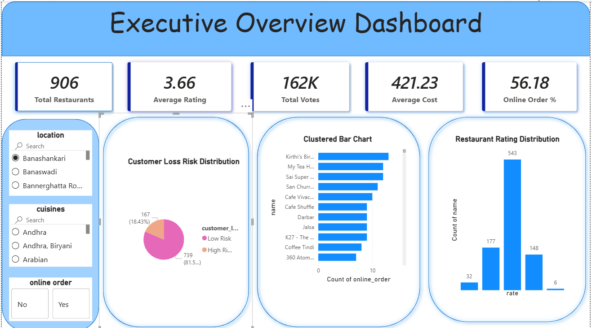
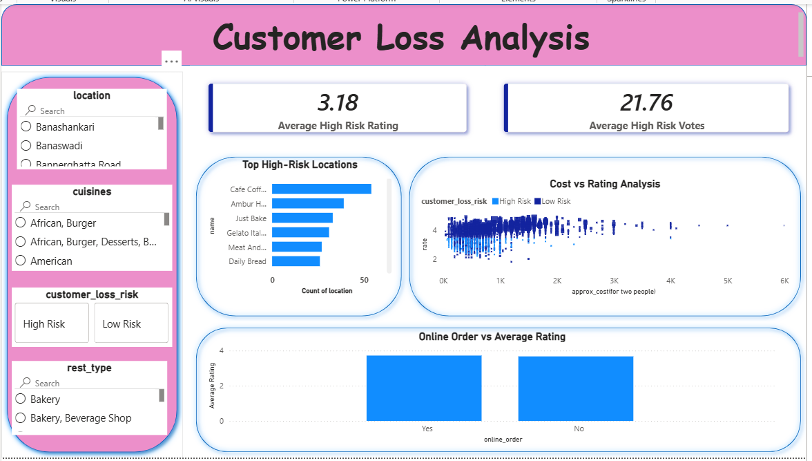
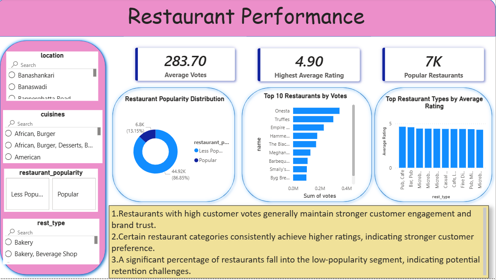
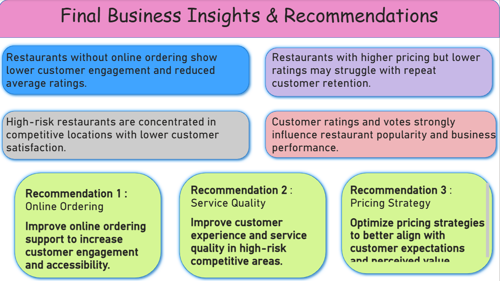

# Why Is Zomato Losing Customers? — Business Intelligence Project

## 📌 Project Overview
This project is an end-to-end Business Intelligence and Data Analytics project focused on identifying the factors affecting restaurant performance and customer retention on Zomato. The analysis helps understand why some restaurants experience lower customer engagement, reduced ratings, and higher business risk.

Using Python, SQL, MySQL, and Power BI, this project performs data cleaning, exploratory data analysis, KPI analysis, and interactive dashboard visualization to generate business insights and strategic recommendations.

---

## 🎯 Business Problem
Zomato contains thousands of restaurants with different pricing, ratings, cuisines, and customer engagement levels. Some restaurants struggle with low ratings, fewer votes, and reduced customer interaction.

This project aims to answer:

- Why are some restaurants becoming high risk?
- Does online ordering improve customer engagement?
- Which locations contain the most high-risk restaurants?
- How do pricing and ratings impact restaurant performance?
- Which restaurant types and cuisines perform best?

---

## 🛠️ Tools & Technologies Used

- Python
- Pandas & NumPy
- Matplotlib & Seaborn
- SQL & MySQL
- Power BI
- Jupyter Notebook

---

## 📂 Project Structure

```bash
zomato-customer-loss-analysis/
│
├── README.md
├── zomato_analysis.ipynb
├── zomato_customer_analysis.sql
├── screenshots/
│   ├── executive_overview.png
│   ├── customer_loss_analysis.png
│   ├── restaurant_performance.png
│   └── final_business_insights.png


📊 Dashboard Pages

1️⃣ Executive Overview

Total Restaurants
Average Ratings
Total Votes
High Risk Restaurant Analysis
Online Order Analysis

2️⃣ Customer Loss Analysis
High Risk Locations
Cost vs Rating Analysis
Online Order vs Ratings
Customer Risk Insights

3️⃣ Restaurant Performance
Top Restaurants by Votes
Top Restaurant Types
Popular vs Less Popular Restaurants

4️⃣ Final Business Insights & Recommendations
Key Business Insights
Strategic Recommendations
Final Business Conclusion
📸 Dashboard Screenshots

Executive Overview

Customer Loss Analysis

Restaurant Performance

Final Business Insights



📈 Key Insights
Restaurants without online ordering show lower customer engagement and ratings.
High-risk restaurants are concentrated in competitive locations with lower customer satisfaction.
Restaurants with higher pricing but lower ratings may struggle with customer retention.
Customer ratings and votes strongly influence restaurant popularity and business performance.

💡 Business Recommendations
Improve online ordering support to increase customer engagement.
Enhance customer experience in high-risk locations.
Optimize pricing strategies to better match customer expectations.
Focus on customer satisfaction and service quality improvements.
📥 Power BI Dashboard File

Due to GitHub file size limitations, the Power BI dashboard file is available here:

🔗 https://drive.google.com/file/d/1kk52o0zsYcTBOf1MLcU3guSyiAY-TeGV/view?usp=drive_link

🚀 Conclusion

This project demonstrates how Business Intelligence and data-driven analysis can help identify customer retention issues, improve restaurant performance, and support strategic business decision-making using real-world restaurant data.
